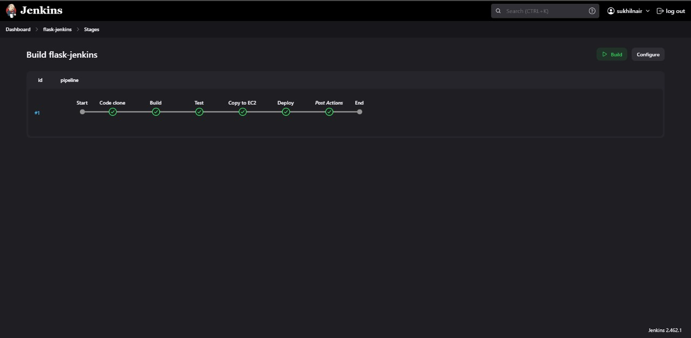

# Simple flask deployment using jenkins
This repository contains a Jenkins pipeline configuration for automating the deployment of a Flask web application to an EC2 instance. The pipeline performs several stages, including cloning the repository, building the environment, testing the code, and deploying the app to an EC2 instance.

## Repository Contents:
- app.py: Flask application code.
- app_test.py: Unit tests for the Flask application using pytest.
- requirements.txt: Dependencies for the Flask app.
- run.sh: Script to start the Flask app on the EC2 instance.
- simpleflask.jenkinsfile: Jenkins pipeline configuration file (this file).

## Prerequisites:
1. A Jenkins instance with the following plugins:
- Git Plugin
- SSH Agent Plugin
2. An EC2 instance (Ubuntu) set up with the necessary environment (e.g., Python, Flask).
3. SSH access to the EC2 instance configured in Jenkins with an SSH credential ID (EC2-access).
4. Python 3 and venv available on the Jenkins server.
## Pipeline Breakdown
This pipeline is defined using Jenkins Declarative Pipeline syntax and has five main stages:

1. Code Clone:

- The source code is cloned from the GitHub repository (https://github.com/Sukhilnair/Simple_flask_deployment_using_jenkins.git) to the Jenkins workspace.
2. Build:

- A Python virtual environment is created using venv.
- Dependencies are installed by reading the requirements.txt file.
3. Test:

- Runs the tests defined in app_test.py using pytest.
- If tests fail, the pipeline will stop with an error message.
4. Copy to EC2:

- Copies the code from the Jenkins workspace to the EC2 instance using scp.
- This step is conditional and will only run if the previous steps were successful.
5. Deploy:

- Logs into the EC2 instance via SSH and runs the run.sh script to start the Flask application.
- This step is also conditional on the success of the previous steps.
## Post-Pipeline Notifications
- Regardless of success or failure, Jenkins will send an email notification with the build details to sukhilnair1996@gmail.com.
## Jenkinsfile Explained
- Agent: The agent any directive allows the pipeline to run on any available Jenkins agent.
- Environment Variables: Defines parameters like the Git repository URL, EC2 host, and deployment directory.
- Stages: The pipeline consists of multiple stages:
- Code clone: Clones the main branch of the repository.
- Build: Sets up a Python virtual environment and installs the dependencies.
- Test: Runs unit tests and halts the pipeline if they fail.
- Copy to EC2: Copies the application files to the specified directory on the EC2 instance.
- Deploy: Starts the Flask application on the EC2 instance using the run.sh script.
- Post Actions: Sends an email notification after each build, regardless of the result.
## Example Commands
### Run pipeline on Jenkins:

1. Clone this repository.
2. Set up Jenkins credentials for accessing the EC2 instance.
3. Configure a Jenkins job using simpleflask.jenkinsfile as the pipeline script.
4. Run the pipeline from Jenkins.

## Notes:
- Ensure that the EC2 instance has Python, Flask, and other dependencies installed.
- Modify the SSH credentials, EC2 details, and email recipient in the Jenkinsfile as needed.

## Final Output
